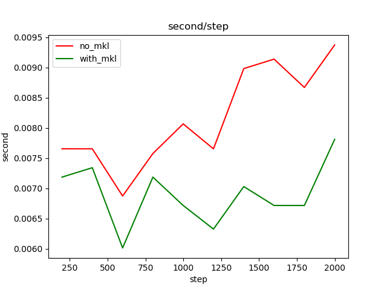

##Purpose##
It's used to compare the performance of tensorflow-mkl and legacy tensorflow.
The legacy tensorflow also could be optimized for Intel CPU.
*  tensorflow in PIP is optimized by OpenBLAS.
*  tensorflow in Conda is optimized by Intel-MKL.*
  
We recommend to use PIP's tensorflow as legacy, or you build your own tensorflow to disable such optimize method.
In Windows 10, the tf-mkl is increased about 10-20% than legacy tensorflow by PIP (optimized by OpenBLAS)

##Usage##
(This example of tensorflow needn't to download dataset from internet.)
**run in tf-mkl**
`python fully_connected_feed.py --mkl=1`
**run in legacy tf**
`python fully_connected_feed.py --mkl=0`

##Steps##
Both actions below should be executed in same folder.
They will share the result of each other and show them.

###1.run in legacy tf###
`python fully_connected_feed.py --mkl=0`

###2. run in tf-mkl###

**Entry conda with Intel Tensorflow**
`activate tf-mkl`
`(tf-mkl) tf> python fully_connected_feed.py --mkl=1`
##Result##

##CNN##
Run in different tf enverionment. Please refer to ###Steps###
`python lenet5.py`

**Following is the optimized record (it's only used for internal training, not use it for customer demo/training)** 

Processor Name: Intel(R) Core(TM) i5-8350U CPU @ 1.70GHz

| tf-mkl | tf-legacy | MKL_NUM_THREADS | inter_op_parallelism_threads | intra_op_parallelism_threads |
| -- | -- | -- | -- | -- |
| 240| 210|	default|default|default|
| 240| 510|	default|8|1|
| 210| 510|	1|4|1|
| 210| 220|	1|default|default|
| 220| 210|	2|default|default|
| 240| 210|	4|default|default|
| 260| 240|	8|default|default|
| 240| 200|	8|4|2|

Intel(R) Xeon(R) Platinum 8180M CPU @ 2.50GHz

| tf-mkl | tf-legacy | MKL_NUM_THREADS | inter_op_parallelism_threads | intra_op_parallelism_threads |
| -- | -- | -- | -- | -- |
| 75 | 67|	default|default|default|
